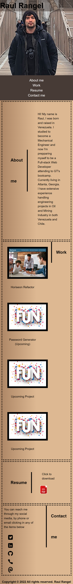

# HW2-Advance Css Portfolio

## Introduction:

The second assignment aims to test our capacity to use more advance CSS features in order to create a responsive professional portfolio.

## Description

The web page was develop using the flexible box property of CSS to set the different elements that we observe on the website. The site has a navegation bar that gives access to the user to all the different sections. When one of the elements of the nav bar is clicked, the screen scrolls to the section requested. All the external links open in different tabs for better navigability.

The web page was design as a responsive one fitting mobile devices, nootebooks and wider resolutions.

## Mobile View

## Notebook View

## Links

1. Repository Link: https://github.com/rrangel07/HW2-Portfolio
2. Deployment Link: https://rrangel07.github.io/HW2-Portfolio/